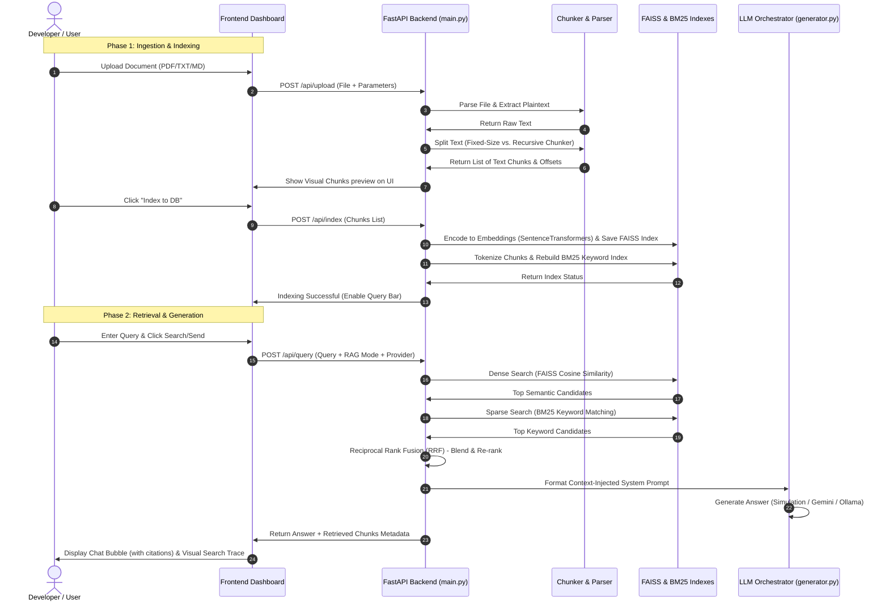
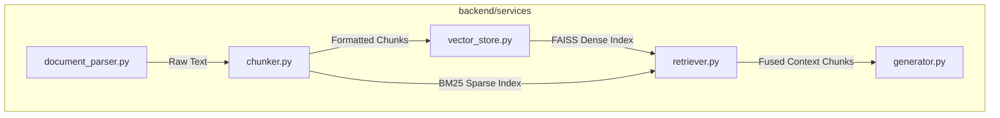

# 🔬 Local RAG & Vector DB Laboratory: Complete Operation Manual & Code Guide

Welcome to the **Local RAG & Vector DB Sandbox Laboratory**. This document serves as a complete technical guide, code walkthrough, and operating manual to help you understand every component of this workspace. 

---

## 🌟 1. System Overview & Architecture

Retrieval-Augmented Generation (RAG) optimizes the output of a Large Language Model (LLM) by referencing an authoritative, external knowledge base (your uploaded documents) before generating a response. 

This sandbox is designed to run **100% locally and transparently**, meaning you can inspect the exact chunks of text, similarity scores, keyword ranks, and combined fusion calculations at every step of the pipeline.

### Pipeline Flowchart

Below is a detailed sequence of how data moves from your local computer into the vector database and eventually to the LLM:

---

## 📂 2. Detailed File-by-File Breakdown

Here is a catalog of every file in the project directory, explaining the code logic and mathematical models used.

### A. Root Files
* **[run.bat](file:///c:/Users/admin/Documents/RAG/run.bat)**:
  * **Role**: Windows Batch Launcher.
  * **Logic**: Activates the Python virtual environment (`venv\Scripts\activate.bat`), opens the default browser to `http://localhost:8000`, and spins up the FastAPI server via `python backend/main.py`.
* **[README.md](file:///c:/Users/admin/Documents/RAG/README.md)**:
  * **Role**: High-level quickstart guide. Summarizes setup commands, configuration options, and contains a comparison matrix comparing local FAISS against cloud providers like Pinecone and Vertex AI Vector Search.

---

### B. Backend Controller & Configuration
* **[backend/config.py](file:///c:/Users/admin/Documents/RAG/backend/config.py)**:
  * **Role**: Settings Manager.
  * **Logic**: Uses Python's `os` library to define standard paths. It points to `data/uploads` and `data/index`. It sets the default local embedding model to `sentence-transformers/all-MiniLM-L6-v2`.
* **[backend/main.py](file:///c:/Users/admin/Documents/RAG/backend/main.py)**:
  * **Role**: FastAPI REST API router.
  * **Logic**: 
    * Initializes endpoints using Pydantic models for request validation.
    * Serves the static HTML interface by mounting `frontend/` to the root route (`/`).
    * Implements lazy-loading for the heavier embedding models so that the server starts instantly.

---

### C. Core Processing Services (`backend/services/`)
This is the scientific core of the application.

#### 1. [document_parser.py](file:///c:/Users/admin/Documents/RAG/backend/services/document_parser.py)
* **What it does**: Ingests files and outputs plain text.
* **How it works**:
  * If the file is a `.pdf`, it uses `pypdf.PdfReader` to extract text from each page, joining them with double newlines (`\n\n`).
  * If the file is plain text (`.txt`, `.md`, `.py`, `.csv`, `.html`, `.json`), it reads the file using UTF-8 encoding, ignoring decoding errors to avoid server crashes.

#### 2. [chunker.py](file:///c:/Users/admin/Documents/RAG/backend/services/chunker.py)
* **What it does**: Breaks long documents into digestible text snippets.
* **Algorithmic Strategies**:
  * **Fixed-Size Chunking**: Loops through character indices with a sliding window. It takes a block of text of length `chunk_size` (e.g. 500 characters), then slides forward by `chunk_size - chunk_overlap`. This is simple but breaks sentences in half.
  * **Recursive Character Chunking**: Designed to keep related sentences and paragraphs together. It takes a list of separators (`\n\n` -> `\n` -> `. ` -> ` `) and recursively splits the text.
    1. It first splits by paragraph dividers (`\n\n`).
    2. If a paragraph is larger than the `chunk_size`, it splits that paragraph by line breaks (`\n`).
    3. If a line is still too large, it splits by sentence boundaries (`. `).
    4. Finally, if a sentence is still too large, it splits by words (` `).
    5. It then runs a merging pass, combining adjacent splits back together up to the maximum `chunk_size`, while preserving the defined overlap.

#### 3. [vector_store.py](file:///c:/Users/admin/Documents/RAG/backend/services/vector_store.py)
* **What it does**: Computes vectors and hosts the local vector database.
* **Mathematical Operations**:
  * **Embeddings**: Uses `SentenceTransformer` to encode text chunks into 384-dimensional dense vectors.
  * **Normalization**: Runs `faiss.normalize_L2(embeddings)`. This converts the vectors to unit length.
  * **FAISS IndexFlatIP**: Initializes an Inner Product index. Because the vectors are L2-normalized, calculating the Inner Product is mathematically equivalent to calculating **Cosine Similarity**:
    $$\text{Cosine Similarity}(A, B) = \frac{A \cdot B}{\|A\| \|B\|} = A \cdot B \text{ (when normalized)}$$
  * **Persistence**: Uses `faiss.write_index` to write the index to a binary file, and `pickle` to serialize the text chunks corresponding to each vector position.

#### 4. [retriever.py](file:///c:/Users/admin/Documents/RAG/backend/services/retriever.py)
* **What it does**: Executes searches and fuses results.
* **Retrieval Methods**:
  * **Dense Search**: Queries the FAISS index to find the top $k$ semantically similar chunks.
  * **Sparse Search**: Tokenizes documents and runs keyword search using the **BM25 Okapi** algorithm. It scores terms based on frequency (how often a term appears in a chunk) adjusted by inverse document frequency (how rare the term is across the document).
  * **Reciprocal Rank Fusion (RRF)**: Merges the ranks of Dense and Sparse search to get a unified ranking. The formula is:
    $$\text{RRF Score}(d) = \frac{1}{60 + \text{Rank}_{\text{Dense}}(d)} + \frac{1}{60 + \text{Rank}_{\text{Sparse}}(d)}$$
    This ensures that if a document is ranked 1st in keyword search but 100th in vector search, it still gets a high combined score, pulling the best of both worlds.

#### 5. [generator.py](file:///c:/Users/admin/Documents/RAG/backend/services/generator.py)
* **What it does**: Combines the prompt, retrieved text context, and query, and triggers the LLM.
* **Prompt Engineering**:
  Constructs a system prompt instructing the LLM:
  * To act as a precise documentation assistant.
  * To answer **ONLY** using the provided context blocks.
  * To reply "I cannot find the answer" if the context does not contain the information (preventing hallucinations).
  * To write inline source citations (e.g. `[1]`, `[2]`).
* **Providers**:
  * **Simulation**: Mock response showing what context was retrieved and how it would be sent to the LLM.
  * **Gemini**: Calls Google's Gemini API key (e.g., `gemini-1.5-flash`).
  * **Ollama**: Sends a local HTTP request to `http://localhost:11434/api/generate` to run models (like `llama3` or `mistral`) offline.

---

### D. Frontend Interface (`frontend/`)
* **[index.html](file:///c:/Users/admin/Documents/RAG/frontend/index.html)**: Builds the UI dashboard. Divided into tabs:
  1. *Chunking tab*: Document upload controls, strategy configurations, and the interactive chunk visualizer.
  2. *Retrieval Analysis tab*: Input query forms and vector/keyword rank detail grids.
  3. *Chat Playground tab*: Main chatbot window.
* **[style.css](file:///c:/Users/admin/Documents/RAG/frontend/style.css)**: Implements UI design: dark theme colors (space background, neon-blue borders, glassmorphic cards, transition animations, custom scrollbars, responsive flex layouts).
* **[app.js](file:///c:/Users/admin/Documents/RAG/frontend/app.js)**: Orchestrates frontend state. Connects UI buttons to API requests, manages state variable configurations, translates raw markdown inside chat answers, and builds visual trace cards.

---

## 🛠️ 3. How to Use the Sandbox (Step-by-Step)

Follow these steps to operate the playground:

### Step 1: Launch the App
1. Go to the project root directory.
2. Double-click `run.bat` (or execute `python backend/main.py` in your terminal).
3. Your browser will automatically open to `http://localhost:8000`.

### Step 2: Upload and Parse a Document
1. Go to the **Ingest Document** section.
2. Drag and drop or browse to select a document (e.g. a `.txt` file, a `.md` markdown file, or a `.pdf` file).
3. Adjust the **Chunk Size** (default: 500 characters) and **Overlap** (default: 50 characters).
4. Select a **Chunking Strategy**:
   * *Fixed-Size*: Fast, mathematical splitting.
   * *Recursive*: Semantic splitting that respects sentences and paragraphs.
5. Click **Process & Preview**.
6. The dashboard will show colored blocks representing your chunks. **Click on any chunk block** to inspect its exact text content in the log preview.

### Step 3: Index Chunks
1. Once you are satisfied with your chunk previews, click **Index to DB**.
2. The backend will parse the text chunks, compute their 384-dimensional embeddings, and save the database to disk.
3. The server status indicator at the top will update to show the total number of indexed chunks.

### Step 4: Run Retrieval Queries
1. Go to the **Search & Retrieval** tab.
2. Type a query (e.g., if you uploaded a python script, search for a function name).
3. Toggle the **Retrieval Mode**:
   * **Dense**: Semantics-only search (matches synonyms and concepts).
   * **Sparse**: Keywords-only search (matches exact characters, terms, and codes).
   * **Hybrid**: Blends both modes using RRF.
4. Click **Search**.
5. Look at the **Visual Search Trace** panel on the side. You can inspect the individual ranks, cosine similarity scores, BM25 weights, and final RRF values for each result.

### Step 5: Start a Chat Generation
1. Switch to the **RAG Chat** tab.
2. Select your **LLM Provider**:
   * *Simulation*: Run instantly without setup. Perfect for checking how the prompt is formatted.
   * *Gemini*: Input a free Gemini API key into the configuration input at the top and hit **Save**.
   * *Ollama*: Make sure Ollama is running (`ollama serve`) and you have pulled a model (`ollama pull llama3`), then enter the model name in the input field.
3. Type your question in the chat bar and hit **Send**.
4. Read the generated response and notice the `[1]`, `[2]` citation markers. Hover over them or check the trace panel to see which chunks informed that answer.

---

## 🏢 4. Where to Use RAG (Real-World Applications)

Retrieval-Augmented Generation is the standard architecture for deploying LLMs on custom, private data. Here is where it is used:

1. **Customer Support Bots**:
   * Ingests help docs, FAQs, and product manuals.
   * Answers user questions accurately, citing specific help articles.
2. **Internal Enterprise Search**:
   * Indexes company wikis, HR policies, and financial statements.
   * Helps employees find company policies without reading hundreds of pages.
3. **Legal Document Analysis**:
   * Indexes contracts, case laws, or compliance rules.
   * Helps lawyers locate clauses, citations, or anomalies across agreements.
4. **Codebase Exploration**:
   * Indexes file structures, function definitions, and comments.
   * Helps developers understand complex code architectures and learn how to use APIs.

---

## 🚀 5. Advanced Optimization Exercises (Things to Try)

Since this sandbox is fully editable, you can write code or change configurations to test advanced RAG concepts:

* **Tweak the Embeddings Model**: Go to [backend/config.py](file:///c:/Users/admin/Documents/RAG/backend/config.py) on line 10 and replace `"sentence-transformers/all-MiniLM-L6-v2"` with another Hugging Face model (like `"sentence-transformers/all-mpnet-base-v2"`) to compare vector quality and processing times.
* **Modify the RRF Constant ($k$)**: Go to [backend/services/retriever.py](file:///c:/Users/admin/Documents/RAG/backend/services/retriever.py) on line 79. Change the `rrf_constant` parameter (default 60) and see how it affects the retrieval scores. Higher numbers reduce the gap between high and low ranks, while lower numbers penalize low rankings heavily.
* **Customize the Prompt**: Go to [backend/services/generator.py](file:///c:/Users/admin/Documents/RAG/backend/services/generator.py) on line 38 and modify the system instruction template to change the LLM's tone (e.g., make it reply in a professional, concise, or humorous style).
